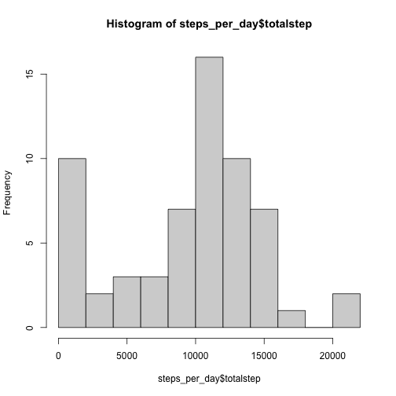
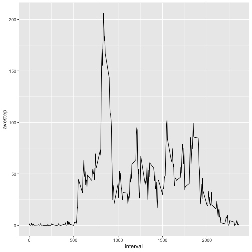
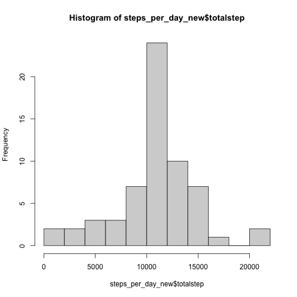

## Introduction

This is an R Markdown document. It is created for Assignment 1 for Reproducible Research at Coursera.com submitted by YX.

First we set up the global option that help us shown all code chunks. Shown only two decimal places of all variables.
Here is the code:


## Loading and preprocessing the data
Saved in cache. Here is the code:

```r
#unzip and read table
unzip("activity.zip")
data <- read.csv("activity.csv")

#show first couple of rows
head(data)
```

```
##   steps       date interval
## 1    NA 2012-10-01        0
## 2    NA 2012-10-01        5
## 3    NA 2012-10-01       10
## 4    NA 2012-10-01       15
## 5    NA 2012-10-01       20
## 6    NA 2012-10-01       25
```


## 1 What is mean total number of steps taken per day?
First group the dataset by date, and calculate sum of each group. Use hist() function to show the results. Here is the code:

```r
library(dplyr)

datagroup_date <- group_by(data, date)
steps_per_day <- summarize(datagroup_date, totalstep = sum(steps, na.rm = TRUE))
hist(steps_per_day$totalstep, breaks = 10)
```



```r
#calculate mean and median of total number of steps per day.
stepsmean <- mean(steps_per_day$totalstep, na.rm = TRUE)
stepsmedian <- median(steps_per_day$totalstep, na.rm = TRUE)
```
The mean of the total number of steps taken per day is 9354.23.

median of the total number of steps taken per day is 10395.00.


## 2 What is the average daily activity pattern?
First group the dataset by interval, and calculate mean of each group. Use ggplots package to make time series plot.

```r
#Calculate the average number of steps taken per interval, averaged across all days
datagroup_int <- group_by(data, interval)
steps_per_int <- summarize(datagroup_int, avestep = mean(steps, na.rm = TRUE))

#Make a time series plot of the 5-minute interval (x-axis) and the average number of steps taken (y-axis)
library(ggplot2)
ggplot(steps_per_int, aes(x = interval, y = avestep)) + geom_line()
```



```r
#Calculate the max of average steps per interval, and find out which interval
maxinterval <- steps_per_int[[which.max(steps_per_int$avestep), 1]]
maxstep <- steps_per_int[[which.max(steps_per_int$avestep), 2]]
```
The 5-minute interval, on average across all the days in the dataset, contains the maximum number of steps is 206.17, and it is interval 835.00


## Imputing missing values

```r
#1. Calculate and report the total number of missing values in the dataset.
number_na <- sum(is.na(data$steps))

#2. Devise a strategy for filling in all of the missing values in the dataset. 
#3. Create a new dataset that is equal to the original dataset but with the missing data filled in.
data_imputed <- data
for(i in 1:nrow(data_imputed)){
        if(is.na(data_imputed$steps[i])){
                #if the step is NA, find out which interval is and save in ii
                ii <- data_imputed[i, 3]
                #use steps_per_int dataset to determine which average 
                #interval steps we want
                impute <- steps_per_int$avestep[steps_per_int$interval == ii]
                #give NA the impute value
                data_imputed[i, 1] <- impute
        }
}

#4. Make a histogram of the total number of steps taken each day and Calculate and report the mean and median total number of steps taken per day.
#calculate the NEW total number of steps per day
library(dplyr)
datagroup_date_new <- group_by(data_imputed, date)
steps_per_day_new <- summarize(datagroup_date_new, totalstep = sum(steps, na.rm = TRUE))
hist(steps_per_day_new$totalstep, breaks = 10)
```



```r
#calculate NEW mean and mediam of new total number of steps per day.
stepsmean_new <- mean(steps_per_day_new$totalstep)
stepsmedian_new <- median(steps_per_day_new$totalstep)
```
Before imputing, the total number of missing values in the dataset is 2304.00.
  
Originally, the mean of the total number of steps taken per day is 9354.23.  
After imputing, the mean of the total number of steps taken per day is 10766.19.

Originally, the median of the total number of steps taken per day is 10395.00.  
After imputing, the median of the total number of steps taken per day is 10766.19.
  

Do these values differ from the estimates from the first part of the assignment? What is the impact of imputing missing data on the estimates of the total daily number of steps?
  
The new mean and median of total number of steps are different from the estimates from the first part of the assignment, and they are more than the estimates before imputing missing values. Because we fill out the average interval steps into the missing places, the average of steps will be more.


## Are there differences in activity patterns between weekdays and weekends?


```r
#1. Create a new factor variable in the dataset with two levels – “weekday” and “weekend” indicating whether a given date is a weekday or weekend day.
data_weekday <- mutate(data_imputed, datefactor = factor(weekdays(as.Date(date,), ab = TRUE) %in% c("Sun", "Sat"), labels = c("Weekday", "Weekend")))


#2. Make a panel plot containing a time series plot (i.e. type = "l") of the 5-minute interval (x-axis) and the average number of steps taken, averaged across all weekday days or weekend days (y-axis).

#Calculate the average number of steps taken per interval, averaged across all weekday and weekend
datagroup_int_date <- group_by(data_weekday, interval, datefactor)
steps_per_int_date <- summarize(datagroup_int_date, avestep = mean(steps, na.rm = TRUE))
```

```
## `summarise()` has grouped output by 'interval'. You can override using the `.groups` argument.
```

```r
#Make a time series plot of the 5-minute interval (x-axis) and the average number of steps taken for weekdays and weekends (y-axis)
library(ggplot2)
ggplot(steps_per_int_date, aes(x = interval, y = avestep)) + geom_line() + facet_grid(datefactor ~ .)
```


There are great difference between daily patterns of weekdays and weekends. In weekdays, people tend to wake up earlier and have a period of high stpes in the morning, followed by a moderate steps taken until going to bed. In weekends, people tend to wake up later and have a averagely higher steps than weekdays throughout all intervals. Also, after 20:00, people seems still actively walking, whereas in weekdays, people seems have very less steps taken after 20:00.

